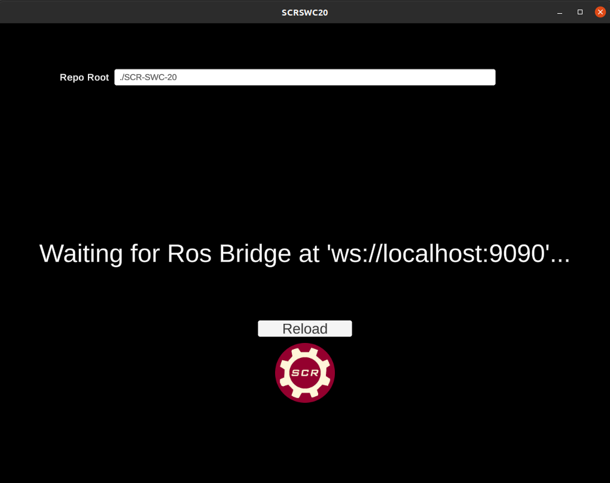
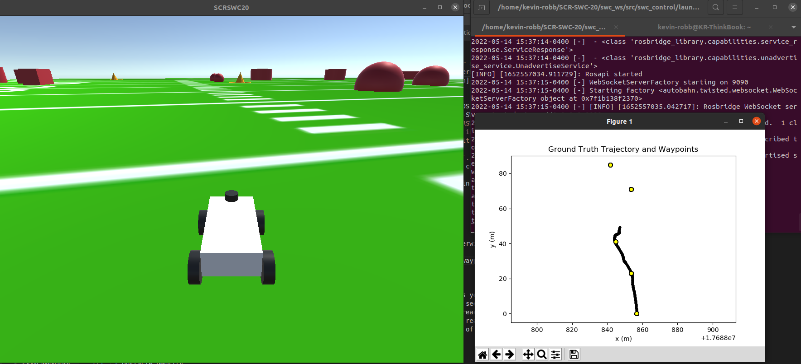

# The SCR Software Challenge 2020
This project was for the Sooner Competitive Robotics Software Challenge in Summer 2020, after all our physical competitions and internships were cancelled due to Covid-19. It uses a simulator made in-house in Unity. The [SCR wiki](https://github.com/SoonerRobotics/SCR-SWC-20/wiki) includes setup and documentation info. This challenge roughly follows the premise and scoring guidelines of the [RoboMagellan competition](http://robogames.net/rules/magellan.php).

# Running My Code
You will need to setup the simulator and clone this repo. I'm using Ubuntu 20.04, and have ROS Noetic installed.
 1. Download the latest version of the [SWC simulator](https://github.com/SoonerRobotics/SCR-SWC-20/releases). Extract all, and move the resulting folder to a directory `~/Simulators/`. Make it executable with `chmod +x ~/Simulators/SCR_SWC_20_SIM_6.0_LINUX/SCRSWC20.x86_64`.
 2. Install rosbridge. This is necessary for the simulator and ROS to communicate. `sudo apt install ros-noetic-rosbridge-server`
 3. Clone this repo to your `~` directory. `git clone git@github.com:kevin-robb/SCR-SWC-20.git`. Edit the `competition.cfg` and `simulator.cfg` to your liking; (for a first test you should probably not change anything).
 4. Launch the simulator. First return home with `cd ~`, and then launch the simulator with `./Simulators/SCR_SWC_20_SIM_6.0_LINUX/SCRSWC20.x86_64`. If it doesn't say "Waiting for ROSBridge", that means you need to fix the path to the repo so it can find the config files. In the bar at the top, enter `./SCR-SWC-20/` and click "Reload". It should be good now.
 <!--  -->
 

 5. With the simulator running, open a new terminal, and run the following to setup my code in this repo.

    cd ~/SCR-SWC-20/swc_ws
    catkin_make
    source devel/setup.bash
    roslaunch swc_control swc_control.launch

 In future runs, you need not run `catkin_make` unless you have created new ROS nodes or otherwise modified the workspace structure.

While it runs, you should see a live plot of the ground truth position of the robot and all waypoints.

 

# Details

The simulator randomizes the locations of waypoints and obstacles each time it is run, unless you change the `Seed=-1` line in `simulator.cfg` to a positive integer, which will force all runs to use this seed. Note that `CompetitionMode=true` forces a random seed, so you must change this to false as well. My code will drive the robot through the course, ideally hitting all three waypoints, avoiding all collisions, and reaching the final goal in minimal time. Each collision increases the damage to the robot, and with enough damage the run will end early in a DNF failure. When the robot reaches the goal in competition mode, the simulator exits and results are written to `~/results.txt`. A lower score is better; score is calculated using a combination of the following factors:
 - Time
 - Vehicle Damage
 - Waypoints 1,2,3 Achieved
 - Obstacle Density
 - Sensor Noise Intensity

These latter two are difficulty settings that can be changed in `competition.cfg`. Harder settings give a better point multiplier, but obviously increase the difficulty. By default, obstacles are set to "normal" and sensor noise is "reduced". 

